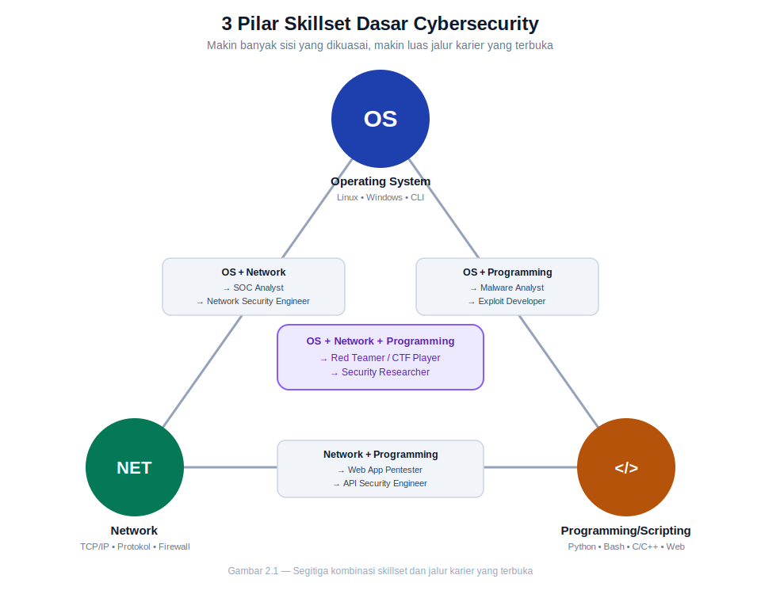

# BAB 2 — OFFENSIVE & DEFENSIVE

> Memetakan dua sisi mata uang cybersecurity: menyerang untuk menguji, bertahan untuk melindungi

---

## Tujuan Pembelajaran

Setelah menyelesaikan Bab 2 ini, peserta diharapkan mampu:

1. Menjelaskan tiga pilar skillset dasar (OS, Network, Programming/Scripting) dan bagaimana kombinasinya membentuk jalur karier di cybersecurity.
2. Membedakan berbagai jenis penetration testing berdasarkan target maupun metodologi akses (Black/Grey/White Box).
3. Membedakan Penetration Testing, Red Teaming, dan Vulnerability Assessment secara konseptual maupun operasional.
4. Memahami mekanisme bug bounty dan prinsip responsible disclosure.
5. Mengenali tools dasar yang umum dipakai praktisi offensive security.
6. Menjelaskan struktur dan peran SOC beserta tingkatan (tier) analisnya.
7. Membedakan pendekatan reaktif (monitoring) dan proaktif (threat hunting) dalam Blue Teaming.
8. Menjelaskan prinsip hardening, patch management, dan Zero Trust Architecture.
9. Menguraikan siklus Incident Response berbasis kerangka NIST.
10. Menjelaskan konsep dan manfaat Purple Teaming sebagai jembatan antara offensive dan defensive.

---

## Daftar Isi

- **2.0 Skillset Pillars** — Tiga Pilar Utama & Kombinasi Jalur Karier
- **2.1 Offensive Security** — Pentest, Red Teaming, VA, Bug Bounty, Tools
- **2.2 Defensive Security** — SOC, Blue Teaming, Hardening, Incident Response
- **2.3 Purple Teaming** — Kolaborasi Red & Blue Team

---

# 2.0 Skillset Pillars (Fondasi Sebelum Masuk ke Offensive/Defensive)

Sebelum membahas offensive vs defensive secara spesifik, ada satu hal yang harus dipahami lebih dulu: **baik red team maupun blue team dibangun di atas fondasi skillset yang sama**. Perbedaannya bukan pada ilmu dasarnya, melainkan pada *bagaimana* ilmu itu dipakai — salah satu "menyerang" untuk menemukan celah, yang lain "bertahan" untuk menutupnya.

Ada **3 pilar skillset dasar** yang jadi fondasi hampir seluruh profesi teknis di cybersecurity. Ibarat segitiga — makin banyak sisi yang dikuasai, makin luas jalur karier yang terbuka.

## 2.0.1. Tiga Pilar Utama

### A. Operating System (OS)

Memahami cara kerja sistem operasi "dari dalam" adalah dasar dari hampir semua aktivitas teknis di cybersecurity — baik untuk mengeksploitasi maupun untuk mengamankan.

- **Linux fundamentals** — permission (rwx, chmod/chown), file system hierarchy, process management, service/daemon. Linux mendominasi dunia server dan tools keamanan (mayoritas distro pentest seperti Kali Linux dan Parrot OS berbasis Linux).
- **Windows internals** — registry, Active Directory (AD, krusial karena mayoritas jaringan korporat masih berbasis AD), PowerShell. Memahami AD secara khusus penting karena menjadi target utama lateral movement dalam serangan enterprise dunia nyata.
- **Command line proficiency** — kemampuan bekerja lewat command line (bash, PowerShell, cmd) jauh lebih powerful dan bisa diotomatisasi dibanding GUI, dan menjadi bahasa "wajib" di hampir seluruh tools keamanan.
- **System hardening & privilege management** — memahami bagaimana memperketat konfigurasi sistem dan mengelola hak akses (least privilege) — sisi defensifnya langsung berkaitan dengan sisi ofensif "privilege escalation" (bagaimana penyerang menaikkan level akses).
- **Log & file system forensics dasar** — kemampuan membaca log sistem dan memahami struktur file system menjadi dasar untuk investigasi insiden di kemudian hari.

### B. Network

Hampir semua serangan siber melibatkan jaringan sebagai medium — memahami cara data "berjalan" adalah prasyarat untuk memahami cara data itu bisa disadap, dialihkan, atau disalahgunakan.

- **TCP/IP model & OSI layer** — kerangka konseptual 4/7 lapisan yang menjelaskan bagaimana komunikasi data terjadi antar perangkat. Ini adalah "peta" yang dipakai untuk memahami di lapisan mana sebuah serangan/pertahanan bekerja.
- **Protokol umum** — HTTP/S (web), DNS (resolusi nama domain), FTP (transfer file), SMB (file sharing Windows, sering jadi target eksploitasi), SSH (akses remote terenkripsi).
- **Routing & switching dasar** — bagaimana data dialihkan antar jaringan (router) dan antar perangkat dalam satu jaringan (switch).
- **Firewall, VPN, proxy** — kontrol lalu lintas jaringan (firewall), koneksi terenkripsi melalui jaringan publik (VPN), dan perantara lalu lintas (proxy) — tiga komponen defensif yang paling sering ditemui.
- **Packet analysis** — kemampuan membaca lalu lintas jaringan mentah menggunakan tools seperti **Wireshark** dan **tcpdump**, keterampilan yang dipakai baik untuk menyerang (mengintersepsi data) maupun bertahan (mendeteksi anomali).

### C. Programming/Scripting

Kemampuan membaca dan menulis kode adalah pembeda utama antara "menjalankan tools orang lain" dan "benar-benar memahami apa yang terjadi di baliknya".

- **Bahasa scripting (Python, Bash)** — untuk otomasi tugas berulang, membuat tools kustom, dan memproses data hasil scan dalam jumlah besar.
- **Bahasa low-level (C/C++)** — untuk memahami manajemen memory dan menjadi dasar memahami exploit development (misalnya buffer overflow) — level pemahaman yang membedakan praktisi pemula dari expert.
- **Web dev dasar (HTML, JS, SQL)** — memahami cara aplikasi web dibangun adalah prasyarat mutlak untuk memahami cara aplikasi web itu bisa dieksploitasi (ingat kembali SQL Injection & XSS dari Bab 1).
- **Membaca & memodifikasi source code** — keterampilan yang sering diremehkan pemula: kemampuan membaca kode orang lain (termasuk source code malware atau exploit PoC yang ditemukan di internet) jauh lebih sering dipakai sehari-hari dibanding menulis dari nol.

## 2.0.2. Kombinasi Skillset → Jalur Karier

Kekuatan dari kerangka ini terletak pada **kombinasinya**. Menguasai satu pilar saja sudah bernilai, tapi kombinasi dua atau tiga pilar sekaligus membuka jalur karier yang jauh lebih spesifik dan bernilai tinggi di pasar kerja.

| Kombinasi Skillset | Pilar yang Belum Mendalam | Jalur Karier yang Terbuka |
|---|---|---|
| **OS + Network** | Programming | System/Network Administrator, SOC Analyst, Network Security Engineer |
| **Network + Programming** | OS (mendalam) | Web App Pentester, Network Automation/Security Engineer, API Security |
| **OS + Programming** | Network (mendalam) | Malware Analyst, Reverse Engineer, Exploit Developer |
| **OS + Network + Programming** | — (ketiganya dikuasai) | Red Teamer, Full-stack Pentester, Security Researcher, CTF Player |

> 💡 **Catatan penting:** Tabel ini bukan berarti pilar yang "belum mendalam" boleh diabaikan sepenuhnya — melainkan menggambarkan **titik berat (center of gravity)** keahlian seseorang. Seorang Malware Analyst tetap perlu paham dasar jaringan (karena banyak malware modern berkomunikasi lewat C2/Command & Control server), hanya saja kedalaman network yang dibutuhkan tidak sedalam yang dibutuhkan seorang Network Security Engineer. Semakin banyak pilar yang dikuasai secara mendalam, semakin fleksibel dan bernilai seorang praktisi — inilah mengapa role seperti **Red Teamer** dianggap salah satu jalur paling senior: menuntut penguasaan ketiga pilar sekaligus.

---

# 2.1 Offensive Security

**Offensive security** adalah pendekatan proaktif: alih-alih menunggu diserang, organisasi secara sengaja menyewa/menugaskan pihak yang berpikir dan bertindak seperti penyerang — namun secara sah dan terkendali — untuk menemukan celah **sebelum** pelaku sungguhan menemukannya. Section ini membedah berbagai bentuk offensive security beserta tools yang menyertainya.

## 2.1.1. Penetration Testing

**Penetration testing (pentest)** adalah simulasi serangan siber yang terencana, memiliki ruang lingkup (*scope*) jelas, izin tertulis dari pemilik sistem, dan tujuan spesifik: menemukan serta membuktikan kerentanan yang bisa dieksploitasi, lalu melaporkannya secara terstruktur beserta rekomendasi perbaikan.

### Jenis Pentest Berdasarkan Target

| Jenis | Target | Fokus Pengujian |
|---|---|---|
| **Web App Pentest** | Aplikasi web | Celah seperti SQL Injection, XSS, broken authentication (kaitkan dengan OWASP Top 10 di Bab 1) |
| **Network Pentest** | Infrastruktur jaringan (internal/eksternal) | Kesalahan konfigurasi, layanan rentan, segmentasi jaringan |
| **Mobile App Pentest** | Aplikasi Android/iOS | Penyimpanan data tidak aman, komunikasi API, reverse engineering aplikasi |
| **Wireless Pentest** | Jaringan nirkabel (WiFi) | Enkripsi lemah, rogue access point, serangan terhadap protokol WiFi |
| **Social Engineering Pentest** | Manusia (karyawan) | Simulasi phishing, physical pretexting, menguji kepatuhan terhadap SOP keamanan |

### Jenis Pentest Berdasarkan Akses Informasi

Selain dikategorikan berdasarkan target, pentest juga dikategorikan berdasarkan **seberapa banyak informasi yang diberikan kepada pentester di awal** — ini disebut metodologi Black/Grey/White Box:

| Metodologi | Informasi yang Diberikan | Analogi | Kelebihan |
|---|---|---|---|
| **Black Box** | Tidak ada informasi internal sama sekali (seperti penyerang eksternal sungguhan) | Mencoba membobol rumah tanpa tahu denahnya | Paling realistis meniru perspektif penyerang nyata |
| **Grey Box** | Informasi sebagian (misal: akun user biasa, dokumentasi API terbatas) | Diberi kunci pintu depan, tapi tidak tahu isi dalam rumah | Keseimbangan antara realisme dan efisiensi waktu |
| **White Box** | Informasi penuh (source code, arsitektur, kredensial admin) | Punya denah lengkap + akses ke seluruh rumah | Paling menyeluruh dan efisien menemukan celah tersembunyi |

> 💡 Tidak ada metodologi yang "paling benar" — pemilihannya tergantung tujuan. Black Box cocok untuk menguji postur keamanan dari sudut pandang penyerang luar; White Box cocok saat tujuannya adalah audit menyeluruh (misalnya sebelum rilis aplikasi kritis) di mana waktu terbatas dan cakupan harus maksimal.

## 2.1.2. Red Teaming

Jika pentest biasanya berfokus pada **menemukan sebanyak mungkin kerentanan dalam scope & waktu tertentu**, **Red Teaming** punya filosofi berbeda: mensimulasikan serangan **end-to-end** semirip mungkin dengan pelaku sungguhan (termasuk APT — lihat kembali Bab 1.1.3), dengan tujuan menguji **kemampuan deteksi dan respons** organisasi, bukan sekadar menemukan celah teknis.

Fokus utama Red Teaming:

- **Evasion** — menghindari deteksi oleh kontrol keamanan (antivirus, EDR, SIEM) selama mungkin, persis seperti yang dilakukan pelaku nyata.
- **Persistence** — mempertahankan akses dalam jangka panjang meski sistem di-reboot atau kredensial diganti.
- **Lateral movement** — bergerak dari satu sistem yang berhasil dikompromikan ke sistem lain dalam jaringan, mensimulasikan bagaimana breach kecil bisa membesar menjadi insiden skala penuh.

> 📌 **Perbedaan kunci dengan Pentest:** Pentest biasanya diketahui oleh tim IT/security internal (kolaboratif, tujuan menemukan kerentanan sebanyak mungkin). Red Teaming sering dilakukan **tanpa sepengetahuan tim Blue Team** (simulasi "kejutan") justru untuk menguji apakah tim defense benar-benar bisa mendeteksi dan merespons serangan nyata — bukan cuma menguji sistemnya, tapi menguji **manusianya dan prosesnya juga**.

## 2.1.3. Vulnerability Assessment

**Vulnerability Assessment (VA)** adalah proses mengidentifikasi, mengukur, dan memprioritaskan kerentanan dalam sistem — biasanya lebih luas cakupannya namun tidak sedalam pentest (VA menemukan dan mengklasifikasikan celah, sementara pentest membuktikan celah tersebut benar-benar bisa dieksploitasi).

- **Scanning otomatis** — menggunakan tools seperti **Nessus** atau **OpenVAS** untuk memindai sistem secara otomatis terhadap database kerentanan yang sudah diketahui (CVE). Efisien untuk cakupan luas, namun rentan menghasilkan *false positive*.
- **Manual verification** — langkah krusial untuk memvalidasi temuan scanner, memastikan kerentanan yang dilaporkan benar-benar nyata (bukan false positive) sebelum dilaporkan ke klien/manajemen — mengabaikan langkah ini bisa merusak kredibilitas laporan.
- **CVSS Scoring (Common Vulnerability Scoring System)** — kerangka standar industri untuk menilai tingkat keparahan (*severity*) kerentanan dengan skor 0–10, dikelola oleh FIRST.org. Versi terbaru adalah **CVSS v4.0** (dirilis akhir 2023, memperluas cakupan ke lingkungan OT/ICS/IoT), namun **CVSS v3.1 masih menjadi versi yang paling banyak dipakai di lapangan** hingga saat ini — termasuk oleh basis data kerentanan nasional AS (NVD) yang masih mempublikasikan skor berbasis v3.1 sebagai standar utama. Memahami cara membaca vector string CVSS (misalnya `AV:N/AC:L/PR:N/UI:N/S:U/C:H/I:H/A:H`) adalah keterampilan yang akan terus dipakai di seluruh laporan vulnerability assessment maupun pentest.

## 2.1.4. Bug Bounty

**Bug bounty** adalah program di mana organisasi mengundang security researcher independen dari seluruh dunia untuk menemukan kerentanan pada sistem mereka, dengan imbalan finansial untuk setiap temuan valid yang dilaporkan. Ini adalah bentuk *crowdsourced security* — alih-alih hanya mengandalkan satu tim pentest internal, organisasi memanfaatkan ribuan hingga jutaan "mata" dari seluruh dunia.

- **Platform** — **HackerOne** (pemimpin pasar dengan sekitar 37–38% mind share praktisi, memproses puluhan ribu laporan valid per tahun dengan total pembayaran bounty tahunan mencapai puluhan juta dolar) dan **Bugcrowd** (posisi kedua, dikenal dengan teknologi *CrowdMatch* yang mencocokkan researcher dengan program yang relevan) adalah dua platform terbesar. Platform lain yang juga populer: Intigriti dan YesWeHack (kuat di Eropa), Synack (undangan khusus, payout lebih tinggi), serta Immunefi (spesialis Web3/crypto).
- **Skill fokus** — mayoritas program bug bounty berfokus pada web/app vulnerability hunting, meski cakupannya kini meluas ke API, mobile, bahkan hardware.
- **Responsible/Coordinated Disclosure** — prinsip etis fundamental dalam bug bounty maupun security research pada umumnya: kerentanan yang ditemukan **tidak** boleh langsung diumumkan ke publik. Researcher wajib melaporkannya secara privat kepada organisasi terlebih dahulu, memberi waktu yang wajar untuk memperbaikinya, baru kemudian (jika disepakati) detail temuan boleh dipublikasikan. Prinsip ini membedakan *ethical hacker* dari pelaku yang mengeksploitasi/menjual temuan mereka — pelanggaran terhadap prinsip ini disebut *full disclosure* tanpa koordinasi, yang berisiko dieksploitasi pihak jahat sebelum sempat diperbaiki.

## 2.1.5. Tools

Tools berikut adalah "alat wajib" yang hampir selalu ditemui di dunia offensive security — masing-masing dengan fungsi spesifik yang saling melengkapi:

| Tool | Kategori | Fungsi Utama |
|---|---|---|
| **Burp Suite** | Web App Testing | Proxy intersepsi HTTP/S — memungkinkan pentester melihat, mengubah, dan mengulang request/response aplikasi web secara manual maupun otomatis; standar industri untuk web app pentest |
| **Wireshark** | Network Analysis | Packet analyzer — menangkap dan menganalisis lalu lintas jaringan secara mendetail hingga level byte |
| **OWASP ZAP** | Web App Testing | Alternatif open-source untuk Burp Suite; scanner kerentanan web otomatis maupun manual |
| **FFUF** | Fuzzing | *Fast web Fuzzer* — menemukan direktori, file, parameter, atau subdomain tersembunyi lewat teknik brute-force berkecepatan tinggi |
| **Censys** | Reconnaissance | Mesin pencari perangkat & aset yang terekspos ke internet — dipakai untuk pemetaan attack surface eksternal (mirip Shodan) |
| **Curl** | HTTP Client | Command-line tool serbaguna untuk mengirim request HTTP secara manual — dasar dari hampir semua scripting/otomasi pengujian web |

> 💡 Daftar ini hanyalah permukaan — dunia tools offensive security sangat luas (mencakup framework eksploitasi, tools untuk password cracking, tools khusus Active Directory, dan lainnya) dan akan dibahas lebih mendalam di bab-bab praktik selanjutnya. Yang lebih penting dari sekadar menghafal nama tools adalah memahami **kategori fungsinya** — karena tools baru terus bermunculan, tapi kategori kebutuhannya (proxy, scanner, fuzzer, recon, packet analysis) relatif tetap.

---

# 2.2 Defensive Security

Jika offensive security bertanya *"di mana celahnya?"*, **defensive security** bertanya *"bagaimana kita mendeteksi, menahan, dan pulih dari serangan — baik yang sudah diprediksi maupun yang belum pernah terlihat sebelumnya?"*. Ini adalah sisi yang bekerja 24/7, karena berbeda dari pentest yang punya tanggal mulai dan selesai, ancaman nyata bisa datang kapan saja.

## 2.2.1. SOC (Security Operations Center) & Monitoring

**SOC** adalah unit terpusat (bisa berupa tim internal maupun layanan pihak ketiga/MSSP) yang bertanggung jawab memantau, mendeteksi, menganalisis, dan merespons insiden keamanan secara berkelanjutan. SOC adalah implementasi nyata dari konsep **continuous monitoring** yang sudah dibahas di Bab 1.5.

Struktur SOC umumnya berjenjang berdasarkan kompleksitas penanganan:

| Tier | Peran | Tanggung Jawab |
|---|---|---|
| **Tier 1** | Alert Triage Analyst | Memantau dashboard SIEM, melakukan triase awal terhadap alert masuk, menyaring false positive, meneruskan kasus yang genuinely mencurigakan ke Tier 2 |
| **Tier 2** | Incident Analyst | Investigasi lebih mendalam terhadap alert yang dieskalasi, melakukan korelasi log dari berbagai sumber, menentukan skala dan dampak insiden |
| **Tier 3** | Threat Hunter / Senior Analyst | Menangani insiden paling kompleks, melakukan threat hunting proaktif (lihat 2.2.2), sering merangkap sebagai mentor Tier 1/2 dan menyempurnakan aturan deteksi |

Dua aktivitas inti SOC yang perlu dipahami:

- **Alert triage** — proses menyaring ribuan notifikasi/alert harian untuk memisahkan yang benar-benar butuh perhatian dari *noise*. Tanpa triase yang baik, tim SOC berisiko mengalami *alert fatigue* — kelelahan akibat terlalu banyak alert, yang justru bisa menyebabkan alert penting terlewat (ingat kembali bagaimana AI membantu proses ini, dibahas di Bab 1.2.1.2).
- **Log correlation** — menghubungkan potongan-potongan log dari berbagai sumber (firewall, endpoint, aplikasi, server) untuk melihat gambaran besar sebuah insiden — satu log tunggal jarang menceritakan keseluruhan cerita, tapi kombinasi banyak log sering mengungkap pola serangan yang jelas.

## 2.2.2. Blue Teaming

**Blue Teaming** mencakup keseluruhan aktivitas defensif, namun sering dibedakan dari SOC "biasa" karena pendekatannya lebih **proaktif**, bukan hanya reaktif menunggu alert muncul.

- **Threat hunting** — aktivitas **secara aktif mencari** tanda-tanda kompromi yang belum terdeteksi oleh sistem otomatis, berdasarkan hipotesis ("kalau penyerang X menyerang kita, jejak apa yang akan mereka tinggalkan?"). Ini adalah kebalikan dari pendekatan pasif "menunggu alert berbunyi" — threat hunter berasumsi penyerang **mungkin sudah ada** di dalam jaringan tanpa terdeteksi, lalu membuktikan atau menyangkalnya secara sistematis.
- **Detection engineering** — disiplin merancang, menulis, dan menyempurnakan aturan deteksi (*detection rules*) pada SIEM/EDR agar pola serangan tertentu benar-benar memicu alert yang akurat — bukan sekadar mengandalkan aturan bawaan vendor. Keahlian ini menjembatani pemahaman teknik serangan (perspektif offensive) dengan cara mendeteksinya (perspektif defensive) — salah satu alasan mengapa Purple Teaming (2.3) begitu bernilai.
- **Deception** — strategi defensif yang membalik logika permainan: alih-alih hanya menghalangi penyerang, tim defense sengaja memasang "jebakan":
  - **Honeypot** — sistem umpan yang sengaja dibuat terlihat rentan/menarik untuk memancing penyerang, sehingga aktivitas mereka bisa diamati dan dipelajari tanpa risiko terhadap aset sungguhan.
  - **Honeytoken** — versi "umpan" dalam skala lebih kecil, misalnya kredensial atau file palsu yang sengaja ditaruh di lokasi tertentu; begitu honeytoken ini diakses/dipakai, itu menjadi sinyal kuat bahwa ada pihak tak berwenang yang sedang menjelajah sistem.

## 2.2.3. Hardening & Patch Management

**Hardening** adalah proses memperketat konfigurasi sistem untuk mengurangi attack surface (ingat kembali Bab 1.4.1) — mematikan layanan yang tidak perlu, menutup port yang tidak digunakan, memperketat kebijakan password, dan sejenisnya.

- **Baseline configuration** — alih-alih menebak-nebak konfigurasi apa yang "cukup aman", industri menggunakan standar acuan seperti **CIS Benchmark** (Center for Internet Security) — kumpulan rekomendasi konfigurasi teruji untuk berbagai sistem operasi, aplikasi, dan perangkat jaringan, yang bisa dijadikan checklist maupun diaudit secara otomatis.
- **Vulnerability remediation** — tindak lanjut nyata atas temuan Vulnerability Assessment (2.1.3): benar-benar menutup celah yang ditemukan, baik lewat patching, perubahan konfigurasi, maupun kontrol kompensasi (compensating control, lihat kembali Bab 1.1.5) jika patch belum tersedia.
- **Zero Trust Architecture (ZTA)** — pergeseran filosofi keamanan jaringan paling signifikan dalam dekade terakhir, diformalkan lewat standar **NIST SP 800-207**. Prinsip intinya: **"never trust, always verify"** — tidak ada lagi asumsi bahwa perangkat/pengguna di dalam jaringan otomatis "aman" hanya karena berada di dalam perimeter. Setiap permintaan akses — dari dalam maupun luar jaringan — harus diautentikasi, diotorisasi, dan diverifikasi ulang secara berkelanjutan, tanpa terkecuali. Filosofi ini menggantikan model lama "castle-and-moat" (bangun tembok kuat di perimeter, percaya penuh pada semua yang ada di dalamnya) yang sudah tidak relevan di era kerja remote dan adopsi cloud masif. Penerapan ZTA yang matang menjadi standar yang makin banyak diwajibkan, baik oleh regulator, mitra bisnis, maupun perusahaan asuransi siber (lihat kembali Bab 1.2.3).

> ⚠️ **Kesalahan umum:** menganggap Zero Trust sebagai satu produk yang bisa dibeli dan langsung selesai. Zero Trust adalah **filosofi arsitektur** yang menyentuh identity, network, endpoint, aplikasi, dan data sekaligus — penerapannya bertahap dan butuh redesain, bukan instalasi satu alat.

## 2.2.4. Incident Response

Sekuat apa pun kontrol preventif, tidak ada sistem yang 100% kebal. **Incident Response (IR)** adalah proses terstruktur untuk menangani insiden keamanan ketika (bukan "jika") insiden itu terjadi. Kerangka yang paling banyak dijadikan acuan adalah siklus dari **NIST SP 800-61**, yang secara umum diajarkan dalam 6 fase:

| Fase | Deskripsi |
|---|---|
| **1. Preparation** | Menyiapkan kebijakan, tim, tools, dan playbook **sebelum** insiden terjadi — fase yang paling menentukan seberapa cepat organisasi bisa merespons nantinya |
| **2. Identification** | Mendeteksi dan memastikan bahwa suatu kejadian benar-benar merupakan insiden keamanan (bukan false positive) |
| **3. Containment** | Membatasi penyebaran/dampak insiden — misalnya mengisolasi sistem yang terinfeksi dari jaringan tanpa mematikannya sepenuhnya (agar bukti forensik tidak hilang) |
| **4. Eradication** | Menghilangkan akar penyebab insiden sepenuhnya — malware, backdoor, akun yang disalahgunakan |
| **5. Recovery** | Memulihkan sistem ke kondisi operasional normal, dengan pengawasan ketat untuk memastikan ancaman benar-benar sudah hilang |
| **6. Lesson Learned** | Evaluasi pasca-insiden — apa yang berhasil, apa yang gagal, dan bagaimana mencegah kejadian serupa terulang; hasilnya menjadi masukan untuk memperkuat fase Preparation berikutnya (siklus ini berputar terus-menerus) |

Selama proses IR — terutama di fase Identification hingga Eradication — kemampuan **Digital Forensics** menjadi krusial: pengumpulan, pengawetan (*preservation*), dan analisis bukti digital secara metodologis dan terdokumentasi (menjaga *chain of custody*), agar temuan bisa dipertanggungjawabkan — baik untuk kebutuhan internal maupun jika kasusnya berlanjut ke ranah hukum.

---

# 2.3 Purple Teaming

Setelah membahas Offensive (2.1) dan Defensive (2.2) secara terpisah, satu pertanyaan wajar muncul: bagaimana kalau keduanya bekerja **bersama**, bukan bergantian?

**Purple Teaming** bukanlah tim ketiga yang berdiri sendiri, melainkan **kolaborasi aktif dan terstruktur** antara Red Team dan Blue Team. Alih-alih Red Team menyerang secara diam-diam lalu menyerahkan laporan berbulan-bulan kemudian, Purple Teaming membuat kedua tim bekerja **secara sinkron**: setiap teknik serangan yang dicoba Red Team langsung diamati oleh Blue Team secara real-time, untuk menjawab pertanyaan konkret — *"apakah kontrol deteksi kita benar-benar menangkap teknik ini? Kalau tidak, kenapa, dan bagaimana memperbaikinya sekarang juga?"*

Tujuan utamanya:

- **Validasi deteksi** — memastikan aturan/kontrol deteksi yang sudah dibangun benar-benar berfungsi sesuai ekspektasi, bukan sekadar asumsi teoretis.
- **Feedback loop untuk perbaikan defense** — mempercepat siklus belajar yang biasanya lambat (pentest → laporan → baca laporan → perbaikan, sering berjarak minggu/bulan) menjadi siklus cepat yang terjadi dalam hitungan jam dalam satu sesi kolaboratif.

Purple Teaming sering dianggap sebagai representasi paling matang dari kolaborasi cybersecurity modern — mengakui bahwa **offensive dan defensive security bukan dua dunia yang bersaing, melainkan dua sisi dari tujuan yang sama**: membuat organisasi benar-benar lebih aman.

---

# Rangkuman Bab 2

- **Fondasi** — Baik offensive maupun defensive security dibangun di atas tiga pilar skillset yang sama: **OS, Network, dan Programming/Scripting**. Kombinasi ketiganya menentukan jalur karier yang terbuka — dari SOC Analyst hingga Red Teamer.
- **Offensive Security** mencakup spektrum dari **Penetration Testing** (terarah, ada scope jelas, bisa Black/Grey/White Box), **Red Teaming** (simulasi end-to-end yang menguji deteksi & respons, bukan cuma teknis), **Vulnerability Assessment** (identifikasi & penilaian severity via CVSS), hingga **Bug Bounty** (crowdsourced security dengan prinsip responsible disclosure) — semuanya didukung tools khusus seperti Burp Suite dan Wireshark.
- **Defensive Security** berputar di sekitar **SOC** (struktur tier 1-2-3, alert triage, log correlation), **Blue Teaming** (threat hunting proaktif, detection engineering, deception), **Hardening & Patch Management** (CIS Benchmark, Zero Trust Architecture), dan **Incident Response** (siklus 6 fase NIST: Preparation → Identification → Containment → Eradication → Recovery → Lesson Learned).
- **Purple Teaming** menjembatani keduanya — bukan tim terpisah, melainkan kolaborasi real-time yang mempercepat siklus validasi dan perbaikan deteksi.

Poin penting yang menghubungkan seluruh Bab 2: **offensive dan defensive bukan dua dunia yang terpisah, melainkan dua perspektif yang saling menguatkan** — dan keduanya berakar dari fondasi teknis yang identik.

---

# Pertanyaan Refleksi

1. Jelaskan mengapa seorang Malware Analyst membutuhkan penguasaan OS dan Programming yang mendalam, namun tidak selalu membutuhkan penguasaan Network sedalam seorang Network Security Engineer.
2. Sebuah perusahaan ingin menguji seberapa cepat tim SOC mereka mendeteksi serangan nyata tanpa memberi tahu tim tersebut sebelumnya. Pendekatan mana yang lebih tepat: Penetration Testing atau Red Teaming? Jelaskan alasannya.
3. Bandingkan Black Box, Grey Box, dan White Box pentest. Dalam skenario apa masing-masing paling tepat digunakan?
4. Seorang vulnerability scanner otomatis melaporkan 200 temuan pada satu sistem. Mengapa langkah manual verification tetap wajib dilakukan sebelum laporan ini diserahkan ke klien?
5. Jelaskan perbedaan mendasar antara pendekatan kerja Tier 1 SOC Analyst dan seorang Threat Hunter.
6. Mengapa Zero Trust Architecture dianggap sebagai pergeseran filosofi, bukan sekadar produk keamanan baru? Kaitkan jawabanmu dengan model keamanan lama "castle-and-moat".
7. Urutkan dan jelaskan singkat keenam fase Incident Response menurut kerangka NIST. Mengapa fase "Preparation" dianggap paling menentukan keberhasilan fase-fase berikutnya?
8. Jelaskan dengan kata-katamu sendiri bagaimana Purple Teaming mengubah "siklus belajar" yang biasanya lambat antara temuan Red Team dan perbaikan oleh Blue Team.

---

# Referensi

Materi pada bab ini disusun dengan merujuk pada sumber-sumber berikut:

- NIST Special Publication 800-207 — *Zero Trust Architecture*
- NIST Special Publication 800-61 — *Computer Security Incident Handling Guide*
- FIRST.org — *Common Vulnerability Scoring System (CVSS) v4.0 Specification Document*
- Center for Internet Security (CIS) — *CIS Benchmarks*
- HackerOne — *Hacker-Powered Security Report* (edisi ke-9, 2025)
- Dokumentasi resmi tools: Burp Suite (PortSwigger), Wireshark, OWASP ZAP, FFUF, Censys
- Laporan tren industri terkait adopsi Zero Trust dan lanskap bug bounty platform (2025–2026)

---

*— Akhir Bab 2 —*
