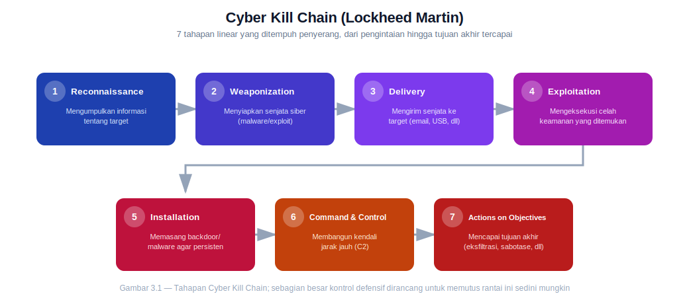

# BAB 3 — HOW ATTACKERS THINK

> Untuk bertahan dari penyerang, kita harus lebih dulu belajar berpikir seperti mereka

---

## Tujuan Pembelajaran

Setelah menyelesaikan Bab 3 ini, peserta diharapkan mampu:

1. Menjelaskan mengapa cybersecurity membutuhkan framework analisis serangan yang terstandarisasi, sama seperti disiplin rekayasa perangkat lunak.
2. Menguraikan 7 tahapan Cyber Kill Chain dan menjelaskan kegunaannya dalam menganalisis serangan.
3. Membedakan Cyber Kill Chain dari MITRE ATT&CK Framework, termasuk struktur Tactics-Techniques-Sub-techniques-Procedures.
4. Menjelaskan peran keluarga framework OWASP (Web, Mobile, AI/LLM) dalam mengamankan berbagai jenis aplikasi.
5. Menjelaskan hubungan antara NIST SP 800-30 (risk assessment) dan NIST CSF 2.0 (enam fungsi: Govern, Identify, Protect, Detect, Respond, Recover).
6. Menjelaskan relasi antara CVE, CWE, CVSS, dan NVD sebagai satu ekosistem yang saling terhubung.
7. Menguraikan cara berpikir penyerang: mencari weakest link, melakukan cost-benefit analysis, dan memprioritaskan persistence & stealth.
8. Menganalisis sebuah studi kasus serangan nyata dan memetakannya ke framework, skillset pillar, dan CIA Triad yang telah dipelajari.

---

## Daftar Isi

- **3.1 Framework Analisis Serangan** — Kill Chain, MITRE ATT&CK, OWASP, NIST, CVE/CWE
- **3.2 Mindset Penyerang** — Weakest Link, Cost-Benefit, Persistence & Stealth
- **3.3 Studi Kasus** — Walkthrough Serangan Nyata & Analisis

---

# 3.1 Framework Analisis Serangan

Dalam dunia Software/Web Development, praktik kerja tidak dibangun dari kebiasaan masing-masing individu — ada standardisasi yang disepakati bersama secara global: ISO/IEC 25010 untuk kualitas perangkat lunak, metodologi Agile/Scrum untuk manajemen proyek, REST/OpenAPI untuk desain API. Standardisasi ini penting karena memberi **bahasa dan struktur yang sama** bagi siapa pun yang terlibat — developer di Jakarta dan developer di Berlin bisa membaca kode dan dokumentasi satu sama lain karena mengikuti konvensi yang disepakati bersama.

Cybersecurity, khususnya dalam menganalisis **bagaimana sebuah serangan benar-benar terjadi**, punya kebutuhan yang persis sama — dan sudah punya jawabannya dalam bentuk beberapa framework yang diadopsi luas secara global. Tanpa framework ini, setiap analis akan mendeskripsikan insiden dengan istilahnya masing-masing ("kena virus aneh", "ada yang aneh di server"), membuat laporan insiden sulit dibandingkan, dikorelasikan antar-organisasi, atau bahkan dipahami analis lain. Framework-framework berikut menyediakan **kosakata dan struktur analisis yang seragam** — persis seperti fungsi ISO di dunia software development.

## 3.1.1. Cyber Kill Chain (Lockheed Martin)

**Cyber Kill Chain** dikembangkan oleh Lockheed Martin (kontraktor pertahanan AS) pada 2011, mengadaptasi konsep militer "kill chain" (rangkaian tahapan yang harus dilalui untuk menghancurkan target) ke ranah siber. Gagasannya elegan: hampir semua serangan siber — betapapun canggihnya — mengikuti pola 7 tahapan yang bisa diprediksi.

| Tahap | Penjelasan |
|---|---|
| **1. Reconnaissance** | Penyerang mengumpulkan informasi tentang target — struktur organisasi, alamat email karyawan, teknologi yang dipakai, celah yang mungkin ada (sering lewat OSINT — Open Source Intelligence, informasi yang tersedia publik) |
| **2. Weaponization** | Menyiapkan "senjata" — menggabungkan exploit dengan payload berbahaya (misalnya dokumen Office yang disisipi malware) |
| **3. Delivery** | Mengirimkan senjata tersebut ke target — lewat email phishing, USB, watering hole attack, dsb |
| **4. Exploitation** | Kode berbahaya benar-benar dieksekusi, memanfaatkan kerentanan (teknis maupun manusia) untuk mendapatkan akses awal |
| **5. Installation** | Memasang backdoor/malware agar penyerang tetap punya akses meski sistem di-restart (ingat kembali "persistence" dari Bab 2.1.2) |
| **6. Command & Control (C2)** | Membangun jalur komunikasi antara sistem korban dan infrastruktur penyerang, agar bisa dikendalikan dari jarak jauh |
| **7. Actions on Objectives** | Penyerang akhirnya mencapai tujuan sesungguhnya — bisa berupa eksfiltrasi data, sabotase, deployment ransomware, atau tujuan lain |

Nilai praktis dari model ini: **defense paling efektif adalah memutus rantai ini sedini mungkin**. Menghentikan penyerang di tahap Reconnaissance atau Delivery jauh lebih murah dan aman dibanding baru menyadarinya di tahap Actions on Objectives — ketika data sudah dicuri atau ransomware sudah terpasang.

> ⚠️ **Keterbatasan Kill Chain:** Model ini bersifat **linear** (satu arah, tahap demi tahap), sehingga kurang cocok menggambarkan serangan modern yang sering tidak berurutan rapi — misalnya insider threat yang sudah punya akses (melewati tahap 1-4 sepenuhnya), atau serangan kompleks dengan banyak *lateral movement* yang terjadi berulang-ulang, bukan sekali jalan lurus. Keterbatasan inilah yang mendorong lahirnya framework yang lebih granular: MITRE ATT&CK.

---

## 3.1.2. MITRE ATT&CK Framework

**MITRE ATT&CK** (Adversarial Tactics, Techniques, and Common Knowledge) adalah basis pengetahuan global yang jauh lebih granular dibanding Kill Chain, disusun oleh MITRE Corporation berdasarkan observasi nyata terhadap ribuan serangan yang benar-benar terjadi di dunia. Cara termudah memahami relasinya dengan Kill Chain:

> **"Kill Chain adalah ceritanya, ATT&CK adalah buku panduan detailnya."** Kill Chain menjelaskan alur besar sebuah serangan dalam 7 babak. ATT&CK menjelaskan, untuk setiap babak itu, **ratusan cara spesifik** yang bisa dipakai penyerang — lengkap dengan contoh kelompok peretas nyata yang pernah memakainya.

Struktur ATT&CK tersusun berjenjang:

- **Tactics** — tujuan taktis penyerang, "mengapa" sebuah aksi dilakukan (setara high-level dengan tahapan Kill Chain, namun lebih banyak — matriks Enterprise ATT&CK saat ini memiliki belasan kategori tactic, mencakup Reconnaissance, Initial Access, Execution, Persistence, Privilege Escalation, Defense Evasion, Credential Access, Discovery, Lateral Movement, Collection, Command and Control, Exfiltration, hingga Impact).
- **Techniques** — cara spesifik mencapai sebuah tactic. Contoh: "Phishing" (kode **T1566**) adalah salah satu technique di bawah tactic Initial Access.
- **Sub-techniques** — variasi yang lebih spesifik lagi dari sebuah technique. Contoh: "Spearphishing Attachment" (**T1566.001**) adalah sub-technique dari Phishing.
- **Procedures** — contoh nyata bagaimana kelompok peretas tertentu (misalnya APT29 atau Lazarus Group) benar-benar mengimplementasikan sebuah technique di lapangan.

ATT&CK dipakai secara luas untuk dua kebutuhan utama:

- **Threat intelligence** — memetakan perilaku kelompok peretas tertentu secara konsisten, sehingga analis di seluruh dunia bisa "berbicara dengan bahasa yang sama" ketika membahas taktik sebuah kelompok ancaman.
- **Detection mapping** — tim Blue Team (ingat kembali Bab 2.2.2) memakai ATT&CK untuk memetakan aturan deteksi mereka terhadap technique tertentu, sehingga bisa mengukur secara objektif: "dari sekian ratus technique yang ada, berapa persen yang benar-benar bisa kita deteksi?" — praktik ini juga menjadi dasar sesi Purple Teaming (Bab 2.3).

> 💡 ATT&CK adalah *knowledge base* yang terus diperbarui (rilis terbaru mencakup ratusan technique dan terus bertambah seiring pola serangan baru ditemukan), bukan dokumen statis. Tersedia juga tool interaktif **ATT&CK Navigator** untuk memvisualisasikan dan memetakan cakupan deteksi organisasi terhadap keseluruhan matriks. Penting dicatat: ATT&CK **bukan** standar kepatuhan atau sistem skoring — ia adalah kerangka deskriptif, bukan alat sertifikasi.

## 3.1.3. OWASP

**OWASP (Open Worldwide Application Security Project)** adalah organisasi nirlaba global yang berfokus pada keamanan aplikasi. Produk paling terkenalnya adalah seri dokumen "Top 10" — daftar risiko keamanan paling kritis untuk kategori aplikasi tertentu, disusun berdasarkan data nyata dari jutaan aplikasi yang diuji.

**Web — OWASP Top 10.** Inilah dokumen kesadaran keamanan web paling berpengaruh di dunia, menjadi rujukan wajib bagi developer maupun security professional. Edisi terbarunya adalah **OWASP Top 10:2025** — revisi besar pertama sejak 2021, disusun dari analisis jutaan aplikasi dan ratusan CWE. **Broken Access Control** tetap bertahan di posisi risiko paling kritis, dan salah satu penambahan paling signifikan adalah kategori baru terkait **kegagalan software supply chain** — mencerminkan kenyataan bahwa aplikasi modern jarang dibangun 100% dari kode internal, melainkan bergantung besar pada dependency pihak ketiga, package repository, dan pipeline CI/CD otomatis yang juga menjadi target serangan.

**Mobile — OWASP MASVS.** *Mobile Application Security Verification Standard* adalah standar setara untuk aplikasi mobile (Android/iOS), berisi kumpulan kontrol keamanan terverifikasi yang tersusun dalam beberapa kategori (mencakup autentikasi, penyimpanan data, kriptografi, hingga privasi). MASVS berjalan berdampingan dengan **MASTG** (panduan pengujian teknisnya — "bagaimana cara menguji setiap kontrol") dan **MASWE** (katalog kelemahan umum yang bisa ditemukan) — pola relasi standar–panduan–katalog kelemahan yang mirip dengan pola CVE/CWE yang akan dibahas di 3.1.5.

**AI/LLM — OWASP Top 10 for LLM Applications.** Ini adalah tambahan **paling baru dan paling cepat berkembang** dalam keluarga OWASP, pertama kali disusun 2023 dan terus direvisi mengikuti kecepatan perkembangan teknologi AI generatif. Beberapa risiko kunci di dalamnya:

- **Prompt Injection** — memanipulasi input agar model AI mengeksekusi instruksi yang tidak dimaksudkan pembuatnya (bertahan di posisi risiko #1 dua edisi berturut-turut).
- **Sensitive Information Disclosure** — model AI secara tidak sengaja membocorkan data sensitif dalam responsnya.
- **Excessive Agency** — sistem AI diberi kewenangan/akses berlebihan, sehingga jika berhasil dimanipulasi bisa mengambil tindakan yang merugikan secara nyata (relevan khususnya untuk AI agent yang memiliki akses ke sistem/tools eksternal).
- **System Prompt Leakage** — kesalahpahaman umum bahwa instruksi sistem ("system prompt") bisa berfungsi sebagai kontrol keamanan; OWASP menegaskan system prompt **bukan** batasan keamanan yang bisa diandalkan, karena sifat LLM yang probabilistik (bukan deterministik) membuatnya sulit dijamin selalu dipatuhi.

Kategori AI/LLM ini semakin relevan seiring adopsi chatbot, AI agent, dan sistem RAG (*Retrieval-Augmented Generation*) yang meluas — area yang akan terus berkembang pesat dan sangat layak dipantau perkembangan terbarunya secara berkala.

## 3.1.4. NIST SP 800-30 & NIST Cybersecurity Framework (CSF)

**NIST SP 800-30** ("Guide for Conducting Risk Assessments") adalah panduan metodologis dari National Institute of Standards and Technology (AS) tentang cara melakukan **risk assessment** secara sistematis — mengidentifikasi threat source, threat event, vulnerability, likelihood, dan impact (ingat kembali relasi istilah-istilah ini dari Bab 1.1.4), lalu menggabungkannya menjadi penilaian risiko yang terstruktur dan bisa dipertanggungjawabkan, bukan sekadar tebakan.

Sebagai pelengkap yang cakupannya lebih luas, ada **NIST Cybersecurity Framework (CSF)** — kerangka kerja tata kelola keamanan siber tingkat organisasi yang jauh lebih dikenal luas lintas industri (tidak terbatas infrastruktur kritis seperti versi awalnya). Sejak pembaruan besar **CSF 2.0**, kerangka ini terdiri dari **6 fungsi inti**:

| Fungsi | Fokus |
|---|---|
| **Govern** *(baru di CSF 2.0)* | Menetapkan strategi, kebijakan, ekspektasi, dan pengawasan manajemen risiko siber di level organisasi — fungsi "payung" yang menaungi kelima fungsi lainnya |
| **Identify** | Memahami aset, risiko, dan konteks bisnis organisasi |
| **Protect** | Menerapkan safeguard untuk membatasi/menahan dampak insiden potensial |
| **Detect** | Menemukan kejadian keamanan siber secara tepat waktu |
| **Respond** | Mengambil tindakan terhadap insiden yang terdeteksi |
| **Recover** | Memulihkan kapabilitas/layanan yang terdampak insiden |

Penambahan **Govern** sebagai fungsi keenam adalah pengakuan eksplisit bahwa keamanan siber yang matang tidak bisa berhenti di level teknis semata — butuh keterlibatan, akuntabilitas, dan pengambilan keputusan di level manajemen/direksi agar kelima fungsi lainnya benar-benar berjalan efektif dan berkelanjutan.

> 📌 **Cara memahami relasinya:** SP 800-30 menjawab pertanyaan **"seberapa besar risiko yang kita hadapi, dan bagaimana cara menghitungnya?"** — sementara CSF menjawab pertanyaan yang lebih luas: **"secara keseluruhan, bagaimana organisasi kita mengelola dan mengatur postur keamanan siber?"**. Risk assessment (800-30) pada praktiknya menjadi salah satu input penting untuk menjalankan fungsi Identify dalam CSF.

## 3.1.5. CVE & CWE

Dua istilah ini adalah tulang punggung "bahasa umum" kerentanan di seluruh industri, dan keduanya saling melengkapi dengan cara yang penting untuk dipahami dengan tepat:

- **CVE (Common Vulnerabilities and Exposures)** — pengenal unik untuk **satu kerentanan spesifik** pada produk/versi tertentu (format `CVE-tahun-nomor`, misalnya `CVE-2024-43573`). Setiap CVE merujuk pada satu kejadian kerentanan yang benar-benar ditemukan di dunia nyata.
- **CWE (Common Weakness Enumeration)** — taksonomi **jenis/kategori kelemahan** secara umum (misalnya CWE-89 untuk "SQL Injection" sebagai kategori kelemahan, CWE-79 untuk "Cross-Site Scripting"). CWE adalah "akar penyebab"-nya, sementara CVE adalah "kejadian spesifik"-nya.

Analoginya: CWE seperti kategori umum "resep masakan yang keliru" (misalnya "lupa mematikan kompor"), sementara CVE adalah laporan kejadian spesifik "restoran X kebakaran pada tanggal Y karena kompor lupa dimatikan". Satu CWE (kategori kelemahan) bisa mencakup ribuan CVE (kejadian spesifik) di berbagai produk berbeda.

Keduanya terhubung dengan dua elemen lain yang sudah dibahas di Bab 2:

- **CVSS** (Bab 2.1.3) — dipakai untuk menilai **seberapa parah** sebuah CVE tertentu.
- **NVD (National Vulnerability Database)** — basis data resmi milik pemerintah AS (dikelola NIST) yang mengumpulkan seluruh data CVE, memperkaya masing-masing entri dengan skor CVSS, referensi CWE terkait, dan metadata lain — menjadikannya rujukan utama yang dipakai vulnerability scanner (ingat kembali Nessus/OpenVAS di Bab 2.1.3) di seluruh dunia untuk mencocokkan temuan mereka.

> 💡 **Catatan tentang ketergantungan infrastruktur:** Program CVE (dikelola MITRE, didanai pemerintah AS) sempat menghadapi ancaman nyata terhentinya pendanaan pada 2025, yang berpotensi melumpuhkan proses pemberian nomor CVE baru secara global selama beberapa waktu — sebelum akhirnya diperpanjang di saat-saat terakhir. Insiden ini memicu terbentuknya **CVE Foundation**, sebuah badan independen yang diinisiasi komunitas sebagai langkah mitigasi agar ekosistem penomoran kerentanan global tidak bergantung pada satu sumber pendanaan tunggal. Ini adalah contoh nyata prinsip **Availability** dari CIA Triad (Bab 1.1.2) diterapkan pada skala infrastruktur industri itu sendiri — bahkan "bahasa umum" kerentanan yang dipakai seluruh dunia pun perlu redundansi agar tetap tersedia.

---

# 3.2 Mindset Penyerang

Framework di 3.1 menjelaskan **struktur** sebuah serangan. Section ini membahas sesuatu yang lebih halus namun sama pentingnya: **pola pikir** yang mendasari keputusan seorang penyerang di setiap tahap. Memahami mindset ini sering kali lebih berguna dalam praktik dibanding hafal nama-nama framework — karena mindset inilah yang membantu seorang defender **mengantisipasi**, bukan sekadar bereaksi.

## 3.2.1. Mencari Weakest Link

Prinsip paling fundamental dalam mindset penyerang: **penyerang tidak butuh menembus sistem tercanggih Anda — mereka hanya butuh menemukan titik terlemahnya.** Ibarat rantai, kekuatan keseluruhan sistem keamanan ditentukan oleh mata rantai yang **paling lemah**, bukan rata-ratanya.

Titik terlemah ini jarang berupa celah teknis yang eksotis. Justru sebaliknya, dalam praktiknya paling sering berupa:

- **Manusia** — karyawan yang mengklik link phishing (ingat kembali Bab 1.1.3), meski firewall dan sistem deteksi organisasi tersebut kelas dunia.
- **Konfigurasi yang salah** — bukan karena sistemnya cacat, tapi karena di-*setup* dengan keliru (misalnya bucket cloud storage yang sengaja dibuka publik untuk keperluan testing, lalu lupa ditutup kembali).
- **Patch yang telat** — kerentanan yang sebenarnya **sudah ada solusinya**, tapi belum sempat diterapkan (ingat kembali kasus Equifax di Bab 1 — bukan zero-day, melainkan patch yang tersedia namun belum diterapkan).

Implikasinya bagi defender: investasi keamanan yang paling bernilai sering kali bukan membeli tools paling canggih, melainkan **menutup celah paling dasar dan paling sering diabaikan** — sesuatu yang jauh lebih membosankan, tapi jauh lebih efektif.

## 3.2.2. Cost-Benefit Analysis dari Sisi Attacker

Penyerang — khususnya yang bermotif finansial (ingat kembali Bab 1.3.2) — pada dasarnya beroperasi seperti pelaku bisnis: mereka menghitung **effort vs value**. Jika usaha untuk menembus target jauh lebih besar dibanding nilai yang bisa didapat, penyerang rasional akan mencari target lain yang lebih "menguntungkan" secara ekonomi bagi mereka.

Prinsip ini menjelaskan fenomena yang sering membingungkan pemula: **kenapa target "kecil" pun bisa jadi sasaran?** Jawabannya sering terletak pada konsep **supply chain attack**: alih-alih menyerang perusahaan besar dengan pertahanan berlapis secara langsung (effort tinggi), penyerang menyasar salah satu **vendor/mitra kecilnya** yang pertahanannya jauh lebih lemah (effort rendah) namun tetap memiliki akses/koneksi ke sistem target besar tersebut. Begitu vendor kecil ini berhasil dibobol, penyerang memanfaatkan hubungan kepercayaan (*trust relationship*) yang sudah ada untuk "menumpang" masuk ke target sebenarnya yang jauh lebih besar.

> 💡 Ingat kembali kategori **Software Supply Chain Failures** yang baru ditambahkan ke OWASP Top 10:2025 (dibahas di 3.1.3) — penambahan ini bukan kebetulan, melainkan respons langsung terhadap makin populernya pola serangan cost-benefit semacam ini di dunia nyata.

## 3.2.3. Persistence & Stealth

Berbeda dari gambaran populer "peretas yang buru-buru mengetik lalu berhasil dalam hitungan detik", penyerang serius — terutama kelompok APT (Bab 1.1.3) dan operator ransomware modern — justru **jarang terburu-buru**. Prioritas utama mereka bukan kecepatan, melainkan **tidak ketahuan**.

Alasannya masuk akal secara strategis: begitu kehadiran mereka terdeteksi, tim defense akan langsung memutus akses, mengganti kredensial, dan menutup celah yang dipakai — mengakhiri operasi mereka lebih cepat dari yang diinginkan. Karena itu, penyerang berpengalaman rela menghabiskan waktu berminggu-minggu bahkan berbulan-bulan **bergerak perlahan dan senyap** di dalam jaringan target — mengumpulkan informasi, memetakan sistem, meningkatkan akses secara bertahap — sebelum akhirnya benar-benar mengeksekusi tujuan akhir mereka di tahap *Actions on Objectives*.

Riset industri terbaru bahkan mencatat tren yang menegaskan hal ini secara empiris: teknik-teknik yang berkaitan dengan *defense evasion* (menghindari deteksi) dan *persistence* (mempertahankan akses) secara konsisten mendominasi daftar teknik MITRE ATT&CK yang paling sering dipakai di dunia nyata — mengonfirmasi bahwa "tidak ketahuan" benar-benar menjadi prioritas nomor satu, bukan sekadar teori.

---

# 3.3 Studi Kasus

Section penutup ini menyatukan seluruh isi Bab 3 — bahkan seluruh Bab 1 dan 2 — dengan membedah satu insiden nyata secara menyeluruh: tahap demi tahap, skillset yang terlibat, dan dampaknya terhadap CIA Triad.

## 3.3.1. Contoh Serangan Nyata: Colonial Pipeline (2021)

**Colonial Pipeline** adalah operator pipa bahan bakar terbesar di Amerika Serikat, memasok hampir setengah kebutuhan bensin dan bahan bakar jet di pesisir timur AS. Pada Mei 2021, perusahaan ini menjadi korban serangan ransomware yang berujung pada penghentian total operasional pipa selama hampir 6 hari — memicu kepanikan publik, antrean panjang di SPBU, hingga pernyataan darurat nasional oleh Presiden AS saat itu.

**Kronologi singkat:**

| Tanggal (Mei 2021) | Kejadian |
|---|---|
| **6 Mei** | Kelompok afiliasi **DarkSide** (grup Ransomware-as-a-Service — ingat kembali Bab 2.3.2) berhasil masuk ke jaringan korporat Colonial Pipeline lewat sebuah akun VPN lama yang **tidak lagi dipakai aktif** namun masih valid, dan **tidak dilindungi Multi-Factor Authentication (MFA)**. Password akun tersebut sebenarnya cukup kompleks — namun sudah pernah bocor lewat kebocoran data lain yang sama sekali tidak terkait, lalu dipakai ulang penyerang (*credential reuse*). Dalam waktu sekitar 2 jam, penyerang mengeksfiltrasi sekitar **100 GB data**. |
| **7 Mei** | Ransomware dieksekusi, mengenkripsi sistem IT korporat (bukan sistem operasional/OT yang mengendalikan aliran pipa secara fisik). Sebagai langkah pencegahan — karena sistem billing dan operasional saling terhubung erat — Colonial Pipeline **secara proaktif mematikan sendiri seluruh operasional pipa** meski OT-nya tidak langsung disusupi. Colonial membayar tebusan senilai **75 Bitcoin (~US$4,4 juta)** pada hari yang sama. |
| **8–9 Mei** | Insiden diumumkan ke publik; kepanikan publik memicu *panic buying* bahan bakar di sepanjang pesisir timur AS; Presiden AS mengumumkan status darurat nasional. |
| **11 Mei** | CISA dan FBI merilis advisory resmi tentang ransomware DarkSide. |
| **12–13 Mei** | Operasional pipa berhasil dipulihkan sepenuhnya. |

Belakangan, Departemen Kehakiman AS berhasil memulihkan sebagian besar dana tebusan yang dibayarkan (lewat pelacakan wallet Bitcoin), dan insiden ini secara langsung mendorong lahirnya Executive Order presidensial AS tentang penguatan keamanan siber nasional.

## 3.3.2. Analisis: Skillset & CIA Triad

**Pemetaan ke Cyber Kill Chain:**

Kasus ini adalah contoh yang cukup rapi untuk dipetakan ke 7 tahap Kill Chain (3.1.1) — meski dengan satu catatan menarik: tahap *Delivery* dan *Exploitation* nyaris menyatu, karena penyerang tidak perlu mengirim malware lewat email phishing seperti skenario klasik — mereka cukup **login memakai kredensial curian yang sah**. Ini adalah pengingat bagus atas keterbatasan Kill Chain yang sudah disinggung sebelumnya: dunia nyata tidak selalu serapi diagram.

- **Reconnaissance** — kemungkinan besar penyerang memperoleh kredensial VPN Colonial Pipeline dari hasil kebocoran data **lain** yang beredar di forum/dark web (bukan hasil serangan langsung ke Colonial).
- **Weaponization** — DarkSide (sebagai operator RaaS) menyediakan platform ransomware siap pakai kepada afiliasinya.
- **Delivery & Exploitation** — kredensial VPN curian dipakai untuk login langsung ke jaringan korporat — berhasil karena **tidak ada MFA** yang menghalangi.
- **Installation** — penyerang bergerak lateral di jaringan dan memasang ransomware di berbagai sistem IT.
- **Command & Control** — komunikasi dengan infrastruktur DarkSide untuk koordinasi kunci enkripsi/negosiasi.
- **Actions on Objectives** — **double extortion**: mencuri ~100GB data (ancaman sebar) **sekaligus** mengenkripsi sistem (tuntutan tebusan untuk kunci dekripsi).

**Skillset yang terlibat (kaitkan ke 3 Pilar Skillset, Bab 2.0):**

| Pilar | Peran dalam Serangan Ini |
|---|---|
| **Operating System** | Memahami lingkungan Windows/Active Directory korporat untuk bernavigasi, meningkatkan akses, dan menjalankan payload ransomware di banyak sistem sekaligus |
| **Network** | Melakukan lateral movement melintasi jaringan internal, memahami arsitektur VPN Colonial serta batas (atau minimnya batas) segmentasi antara jaringan IT dan OT |
| **Programming/Scripting** | Payload ransomware DarkSide itu sendiri, ditambah tooling otomatis untuk mengeksfiltrasi ~100GB data hanya dalam ~2 jam |

**Dampak terhadap CIA Triad (Bab 1.1.2):**

- **Confidentiality — dilanggar.** ~100GB data korporat berhasil dicuri dan dipakai sebagai alat pemerasan tambahan (double extortion).
- **Integrity — relatif tidak menjadi target utama.** Ransomware jenis ini tidak berusaha mengubah/memalsukan isi data (berbeda dari serangan yang memanipulasi data secara diam-diam) — fokusnya adalah membuat data **tidak bisa diakses**, bukan membuatnya salah.
- **Availability — inilah dampak paling dramatis dan paling terlihat publik.** Operasional pipa terhenti hampir 6 hari, memutus pasokan bahan bakar bagi jutaan orang di pesisir timur AS — bukti nyata bahwa pelanggaran Availability bisa berdampak jauh melampaui kerugian finansial perusahaan itu sendiri, merembet ke masyarakat luas (ingat kembali pembahasan infrastruktur kritis di Bab 1.4.2).

> 🇮🇩 **Pola serupa juga terjadi di Indonesia.** Pada Mei 2023, **Bank Syariah Indonesia (BSI)** — bank syariah terbesar di Indonesia — mengalami serangan ransomware oleh kelompok **LockBit 3.0** yang melumpuhkan layanan ATM, mobile banking, dan kantor cabang selama beberapa hari. LockBit mengklaim mencuri 1,5 TB data (informasi lebih dari 15 juta nasabah dan karyawan) dan menuntut tebusan US$20 juta. Setelah negosiasi gagal, LockBit benar-benar mempublikasikan data curian tersebut di dark web. Polanya nyaris identik dengan Colonial Pipeline: akses awal → eksfiltrasi data → enkripsi sistem → double extortion → dampak Availability yang langsung dirasakan publik (nasabah tidak bisa bertransaksi) — menegaskan bahwa framework dan pola yang dipelajari di bab ini berlaku universal, bukan cuma relevan untuk kasus-kasus di luar negeri.

---

# Rangkuman Bab 3

- **Framework Analisis Serangan** memberi cybersecurity "bahasa umum" yang sama seperti standardisasi di dunia software development. **Cyber Kill Chain** memetakan alur besar serangan dalam 7 tahap linear; **MITRE ATT&CK** memberi detail jauh lebih granular lewat struktur Tactics-Techniques-Sub-techniques-Procedures ("Kill Chain adalah ceritanya, ATT&CK adalah buku panduannya"); keluarga **OWASP** (Web, Mobile/MASVS, AI-LLM) memetakan risiko spesifik per kategori aplikasi; **NIST SP 800-30** dan **CSF 2.0** menyediakan metodologi risk assessment dan tata kelola keamanan tingkat organisasi (Govern-Identify-Protect-Detect-Respond-Recover); serta **CVE/CWE/CVSS/NVD** membentuk satu ekosistem terhubung untuk mengidentifikasi, mengategorikan, dan menilai kerentanan secara konsisten di seluruh dunia.
- **Mindset Penyerang** mengajarkan bahwa serangan yang berhasil jarang soal kecanggihan teknis semata — melainkan soal menemukan **weakest link**, menghitung **cost-benefit** secara rasional (termasuk lewat supply chain attack), dan mengutamakan **persistence & stealth** di atas kecepatan.
- **Studi kasus Colonial Pipeline** membuktikan bagaimana seluruh konsep dari Bab 1–3 saling terhubung dalam satu insiden nyata: kredensial VPN tanpa MFA (weakest link) yang dieksploitasi kelompok RaaS (Bab 2) mengikuti pola Kill Chain (3.1.1), melibatkan ketiga pilar skillset (Bab 2.0), dan berujung pada pelanggaran Confidentiality serta — yang paling dramatis — Availability (Bab 1.1.2), dengan pola yang terbukti berulang di Indonesia lewat kasus BSI.

---

# Pertanyaan Refleksi

1. Jelaskan analogi antara standardisasi di dunia software development (seperti ISO) dengan framework analisis serangan di cybersecurity. Mengapa keduanya sama-sama dibutuhkan?
2. Gunakan kalimat "Kill Chain adalah ceritanya, ATT&CK adalah buku panduannya" — jelaskan maksud kalimat ini dengan kata-katamu sendiri, lengkap dengan contoh.
3. Sebuah organisasi ingin tahu: "dari seluruh teknik serangan yang mungkin dipakai peretas, berapa persen yang benar-benar bisa kita deteksi?" Framework mana yang paling tepat dipakai untuk menjawab pertanyaan ini, dan mengapa?
4. Jelaskan perbedaan antara CVE dan CWE menggunakan analogimu sendiri (selain analogi resep masakan yang dipakai di bab ini).
5. Mengapa penambahan fungsi "Govern" di NIST CSF 2.0 dianggap penting? Apa yang terjadi jika sebuah organisasi kuat di lima fungsi lain tapi lemah di Govern?
6. Jelaskan mengapa "menyerang vendor kecil untuk menembus target besar" (supply chain attack) adalah keputusan yang rasional dari sudut pandang cost-benefit analysis seorang penyerang.
7. Pada kasus Colonial Pipeline, tahap Delivery dan Exploitation Kill Chain nyaris menyatu. Jelaskan mengapa hal ini terjadi, dan apa pelajarannya tentang keterbatasan model Kill Chain yang linear.
8. Bandingkan dampak CIA Triad pada kasus Colonial Pipeline dan kasus BSI. Elemen mana yang paling menonjol di masing-masing kasus, dan mengapa?

---

# Referensi

Materi pada bab ini disusun dengan merujuk pada sumber-sumber berikut:

- Lockheed Martin — *Cyber Kill Chain®* framework documentation
- MITRE ATT&CK® — knowledge base resmi (attack.mitre.org), termasuk rilis v19 (April 2026)
- OWASP Foundation — *OWASP Top 10:2025*, *OWASP MASVS v2.1.0*, *OWASP Top 10 for LLM Applications (2025)*
- NIST Special Publication 800-30 — *Guide for Conducting Risk Assessments*
- NIST — *Cybersecurity Framework (CSF) 2.0*
- MITRE — *Common Vulnerabilities and Exposures (CVE) Program* & *Common Weakness Enumeration (CWE)*
- NIST — *National Vulnerability Database (NVD)*
- CISA & FBI — *Joint Cybersecurity Advisory: DarkSide Ransomware* (Mei 2021)
- Pemberitaan seputar insiden Colonial Pipeline (2021) dan Bank Syariah Indonesia (2023) dari berbagai sumber termasuk laporan pemerintah AS dan liputan media Indonesia

---

*— Akhir Bab 3 —*
